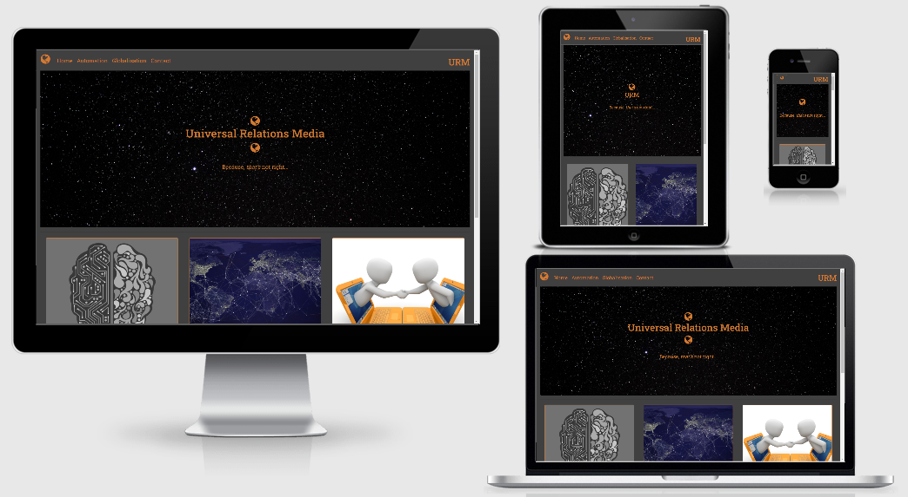
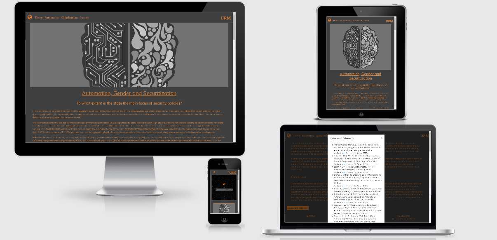
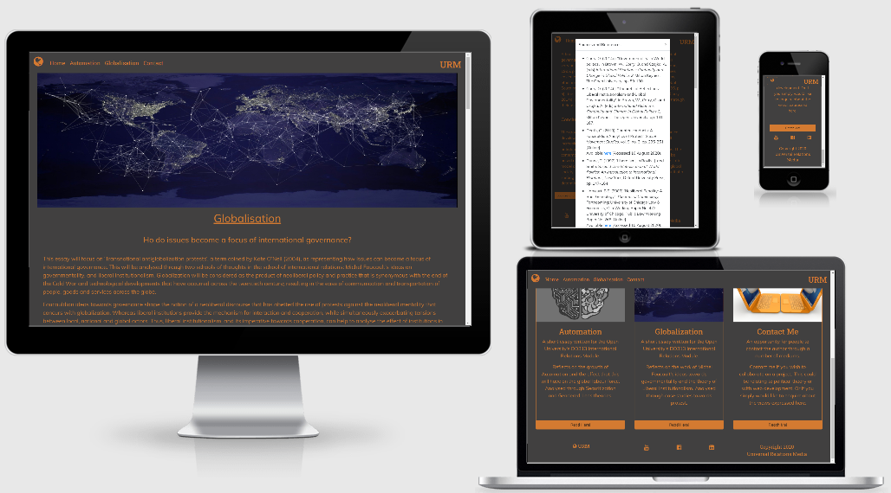
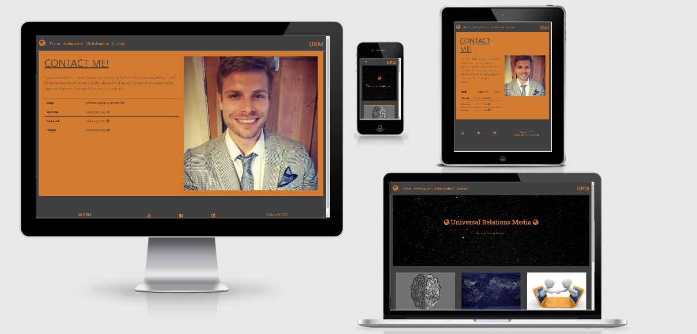

# Universal Relations Media

[View the live website here](https://tobinstonelake.github.io/urmv2/index.html)



This is the first Milestone Project for the 
Code Institute's Full Stack Developer course.

In this project, we have been asked to utilise the 
skills that have been developed with HTML, CSS and 
a touch of JavaScript throughout the course. The use 
of JavaScript benefits us to create a more visually 
appealing page, while also allowing us to use as 
many of Bootstrap's functions as possible.

A further criterion for this project is aimed at writing
this page within the remits of Responsive Design. This 
will be adhered to and the visual impact of the pages 
will change depending on the media query that the 
device presents this content. By using Responsive Design 
principles, we can create a website that functions
efficiently and effectively across all devices.

This site, *Universal Relations Media*, is a faux 
blog site for articles that relate to politics across 
the globe.

## UX

### User Stories

* First Time Visitor Goals
    1. As a First Time Visitor, I want to be able to easily access the
        authors own projects and contact page from the homepage and navigation bar.
    1. As a First Time Visitor, I wish to be able to learn more about the content
        that is presented across the site.
    1. As a First Time Visitor I want to gain a perspective towards the capabilities
        of the author's academic potential. In terms of both political theory and development.

* Returning and Frequent Visitor Goals
    1. As a Returning or Frequent Visitor, I want to be able to view the progession of the author's work.
        Periodically and dynamically.
    1. As a Returning or Frequent Visitor, I want to be able to easily contact the author to be able to 
        colloborate and gain any extra information that they would like.
    1. As a Returning or Frequent Visitor, I want to be able to have a number of different options towards 
        contacting the author.

* Site Owner Goals
    1. The Site Owner's goal is to utilise digital platforms to 
        shape a personal portfolio of the author's academic research
        and written work.
    1. The Site Owner's goal will improve their chance of employability
        by highlighting the capabilities of the author across a 
        number of academic disciplines: Political Philosophy and 
        Full Stack Development.
    1. The Site Owner's indication towards this goal is the 
        the choice to include a contact page for the author to promote 
        collaboration and allow potential employers or anyone that 
        is interested in the site content, can reach out to the author.

### Design

* Colour Scheme
    * The colour scheme used has been a light slate grey and darker orange. This is to create a
        visually appealing site that is akin to the _Night Mode_ found across a plethora of devices.

* Typography
    * There have been two fonts used throughout the project. Muli is the main font used throughout the
        website due to the author's preference. It has a clean and flippant style which highlights
        the tongue-in-cheek nature of the website name and author's style. This is complemented with
        Sans Serif as a fall back.
    * For the navigation bar and any other textual elements that can be considered as a logo, Roboto Slab
        has been utilised to define these textual elements as seperate from the content within the page.
        This has Serif as a fallback, also complementing the nature of a defined element of text away from
        the remaining content.

* Imagery
    * Images have been used on each page to create a more visually appealing experience for the user. The only
        page where an image will not be present is the contact page on smaller devices. This is to keep the contact
        page concise and easy to navigate as it has little content within. On larger devices it gives the user a visual
        impression of who the author is.
    * Across the other pages, images have been used to catch the user's eye and be representative of the content within.
        On the Automation page, there has been two images included which corroborate with the content. 

* Wireframes
    * [Wireframe](assets/images/wireframe.pdf)

## Features

* Responsive across all devices.

* Interactive elements:
    * The main interactive element found on this site is the modal at the 
        bottom of the blog pages. This gives the user the ability to conduct
        their own research towards any information they find interesting within
        the content. This ability is abetted by the use of academically-standardised
        Harvard referencing, which is likely to be a format that the reader understands
        and provides them all the information to find sources that are physical materials, 
        such as books.            
    * To complement this ease of user-research further, any sources that are available
        online have been directly linked to and accessible by the user. This includes
        pay-to-view content, free content and sources from mainstream media.
    * The navigation bar is also interactive by the provision of a collapsible button that
        allows the user to easily find their way to any page on the site. While still adhering
        to the visual appeal of the site when viewed on smaller devices.

### Features left to implement

* I would have liked to have included a carousel on the bottom
of each page to link to any of the other pages across the
site.

## Technologies Used

### Languages Used

* [HTML 5](https://en.wikipedia.org/wiki/HTML5)
* [CSS3](https://en.wikipedia.org/wiki/Cascading_Style_Sheets)

### Frameworks, Libraries & Programs Used

1. [Bootstrap 4.5:](https://getbootstrap.com/docs/4.5/getting-started/introduction/)
    - Bootstrap was used to assist with the responsiveness and styling of the website.
1. [Google Fonts:](https://fonts.google.com/)
    - Google fonts were used to import the 'Muli' and 'Roboto Slab' fonts into the style.css file which is used on all pages throughout the project.
1. [Font Awesome:](https://fontawesome.com/)
    - Font Awesome was used on all pages throughout the website to add icons for aesthetic and UX purposes.
1. [jQuery:](https://jquery.com/)
    - jQuery came with Bootstrap to make the navbar responsive and other Bootstrap functions.
1. [Git](https://git-scm.com/)
    - Git was used for version control by utilizing the Gitpod terminal to commit to Git and Push to GitHub.
1. [GitHub:](https://github.com/)
    - GitHub is used to store the projects code after being pushed from Git.
1. [Balsamiq:](https://balsamiq.com/)
    - Balsamiq was used to create the [wireframes](https://en.wikipedia.org/wiki/Website_wireframe) during the design process.
1. [Microsoft Word:](https://www.microsoft.com/en-gb/microsoft-365/word)
    - Was used to write the content and ensure that the grammatical nature of the content was preserved.    


## Testing

### Testing User Stories from User Experience (UX) Section

* First Time Visitor Goals
    1. As a First Time Visitor, I want to be able to easily access the
        authors own projects and contact page from the homepage and navigation bar. 

        1. The navigation bar is fixed across all pages and links to each page. [Navigation Bar](assets/images/navbar.png)
        2. On smaller devices the navigation links are combined into a dropdown button. [Button](assets/images/button.png)
        3. The cards at the bottom of the homepage indicate what each page is about and has an easy to find button
            take the user to the relevant site. [Card](assets/images/card.png)

    1. As a First Time Visitor, I wish to be able to learn more about the content
        that is presented across the site.

        1. At the bottom of each of the blog pages there is a modal which pop ups with all citations used
            within the content. [Modal](assets/images/modalbtn.png)
        2. Once the modal has been opened, each source has been referenced following the Harvard
            referencing system. An industry standard for content of this nature. [Modal Content](assets/images/modcnt.png)
        3. Any sources, which are the majority, that can be found online have the relevant link to access
            the source. [Modal Link](assets/images/modlink.png)

    1. As a First Time Visitor I want to gain a perspective towards the capabilities
        of the author's academic potential. In terms of both political theory and development.

        1. The content of the page clearly conveys the authors academic potential.
        2. Due to the nature of this being a website also built by the content author, 
            it clearly conveys the technical capabilities towards their development skills.

* Returning and Frequent Visitor Goals
    1. As a Returning or Frequent Visitor, I want to be able to view the progession of the author's work.
        Periodically and dynamically.

        1. As the user returns to the site, the site will be updated with new articles as
            soon as they are completed.

    1. As a Returning or Frequent Visitor, I want to be able to easily contact the author to be able to 
        colloborate and gain any extra information that they would like. [Contact Page](assets/images/contactpg.png)

        1. There is a contact page that can be easily accessed from the navigation bar and homepage.
        2. Within this contact page, there are a number of mediums that could potentially lead to
            contacting the author.

    1. As a Returning or Frequent Visitor, I want to be able to have a number of different options towards 
        contacting the author.

        1. On the footer, the social media links can be found across all pages. Allowing the user to
            contact the author dynamically, even if they are not on the contact page. [Social Links](assets/images/socmed.png)
        2. Email, YouTube, Facebook and LinkedIn information is provided on the contact page.

* Site Owner Goals
    1. The Site Owner's goal is to utilise digital platforms to 
        shape a personal portfolio of the author's academic research
        and written work.

        1. The site clearly conveys on the homepage cards the nature of the content that has been
            written and which projects the content can be attributed from. [Original Source/Idea](assets/images/cardethos.png)
        2. With the use of the modal at the bottom of each page, any user can easily find the sources
            that the author amassed and based the written content on. [Modal Content](assets/images/modcnt.png)

    1. The Site Owner's goal will improve their chance of employability
        by highlighting the capabilities of the author across a 
        number of academic disciplines: Political Philosophy and 
        Full Stack Development.

        1. The content included has been the highest graded pieces of work that the author has written.
            Therefore, it reflects the most academically sound ability of the author.
        2. By using a digital platform to showcase the author's work, it conveys the development ability
            that the author also has.
        3. The choice towards the aesthetic design principles across the site highlights the creative
            eye for detail that the author has in presenting their own work. Across both disciplines. 

    1. The Site Owner's indication towards this goal is the 
        the choice to include a contact page for the author to promote 
        collaboration and allow potential employers or anyone that 
        is interested in the site content, can reach out to the author.

        1. Contact information can easily be found on the footer, across all pages, and through
            a dedicated contact page. [Contact Page](assets/images/contactpg.png) / [Footer Social Links](assets/images/socmed.png)

### Achieved Testing

* Throughout the project, I have been viewing my site across a
number of devices. Including mobiles, tablets, a range of monitors
with different ratios and utilising the inspect element capability 
on Google Chrome to give me further insight into how the site 
functions across devices that I do not have access to.

* During this period, my main focus was to ensure that the site 
was responsive, followed its theme and was as visually appealing
and was useable across all devices.

* My largest issue has been with the navigation bar and footer.
This is due to issues with them overlapping or underlapping
the primary page content. Their general size across the pages
has also given me difficulties.

* Overcoming the aria-controls error I had when validating my code,
    required me to refer to Stack Overflow.

* Checked all links across all pages lead to the relevant pages.

### Further Testing

* In some instances, my pictures fully are not fully
    responsive. The picture becomes cropped at certain
    media queries and I have been unable to rectify this issue within
    the timeframe of the project.

### Known Issues

* There are some final little aesthetic issues that I would like to fix:
    * On some devices elements also become slightly unaligned, such as 
        the URM on the top right of the navigation bar.
    * When smaller devices are used in landscape mode, the footer on the
        contact page seems to be much larger than on other devices.
    * When smaller devices are used in landscape mode, some of the images can
        also become shrunk.

* One visual issue that I am unable to overcome is the margins when switching to
    the Galaxy Fold emulator on Google Chrome's inspect function. Unsure whether this
    is a browser issue or an issue that relates to my code. Is not affected
    on any other emulated devices, though it does carry this issue through
    after clicking on another emulated device. This latter aspect inspires
    confidence that is a Chrome issue, rather than with my own code.

* I am unable to work out why there are two error messages on my index.html validation.
    To my knowledge, I do have a h1 element, upon ther overlay, and I had the same issue
    previously with my other html pages. They have been resolved, so I am unsure why this
    has not followed suit with the index page.

### Screenshots across different devices








### W3 Validators

The W3C Markup Validator and W3C CSS Validator Services were used to validate every page. 
This led to a number of errors being present and resolutions needed to overcome said issues.
Evidence of these tests can be found below:

#### CSS

[Test 1](assets/images/cssvalidatort1.png) / [Test 2](assets/images/cssvalidatort2.png) / [Test 3](assets/images/cssvalidatort3.png)

#### Index HTML

[Test 1](assets/images/indexvalidt1.png) / [Test 2](assets/images/indexvalidt2.png) / [Test 3](assets/images/indexvalidt3.png) / [Test 4](assets/images/indexvalidt4.png)

#### Automation HTML

[Test 1](assets/images/autovalidt1.png) / [Test 2](assets/images/autovalidt2.png) / [Test 3](assets/images/autovalidt3.png) / [Test 4](assets/images/autovalidt4.png)

#### Globalisation HTML

[Test 1](assets/images/globvalidt1.png) / [Test 2](assets/images/globvalidt2.png) / [Test 3](assets/images/globvalidt3.png) / [Test 4](assets/images/globvalidt4.png)

#### Contact HTML

[Test 1](assets/images/contvalidt1.png) / [Test 2](assets/images/contvalidt2.png) / [Test 3](assets/images/contvalidt3.png) / [Test 4](assets/images/contvalidt4.png)

## Deployment

### GitHub Pages

This project was deployed to GitHub pages for ease, as the project was written in Gitpod.
It required the following steps:

1. Log in to GitHub and locate the [GitHub Repository](https://github.com/)
2. At the top of the Repository (not top of page), locate the "Settings" Button on the menu.
3. Scroll down the Settings page until you locate the "GitHub Pages" Section.
4. Under "Source", click the dropdown called "None" and select "Master Branch".
5. The page will automatically refresh.
6. Scroll back down through the page to locate the now published site [link](https://github.com) in the "GitHub Pages" section.

### Forking the GitHub Repository

By forking the GitHub Repository we make a copy of the original repository on our GitHub account to view and/or make changes without affecting the original repository by using the following steps...

1. Log in to GitHub and locate the [GitHub Repository](https://github.com/)
2. At the top of the Repository (not top of page) just above the "Settings" Button on the menu, locate the "Fork" Button.
3. You should now have a copy of the original repository in your GitHub account.

### Making a Local Clone

1. Log in to GitHub and locate the [GitHub Repository](https://github.com/)
2. Under the repository name, click "Clone or download".
3. To clone the repository using HTTPS, under "Clone with HTTPS", copy the link.
4. Open Git Bash
5. Change the current working directory to the location where you want the cloned directory to be made.
6. Type `git clone`, and then paste the URL you copied in Step 3.

```
$ git clone https://github.com/YOUR-USERNAME/YOUR-REPOSITORY
```

7. Press Enter. Your local clone will be created.

```
$ git clone https://github.com/YOUR-USERNAME/YOUR-REPOSITORY
> Cloning into `CI-Clone`...
> remote: Counting objects: 10, done.
> remote: Compressing objects: 100% (8/8), done.
> remove: Total 10 (delta 1), reused 10 (delta 1)
> Unpacking objects: 100% (10/10), done.
```

Click [Here](https://help.github.com/en/github/creating-cloning-and-archiving-repositories/cloning-a-repository#cloning-a-repository-to-github-desktop) to retrieve pictures for some of the buttons and more detailed explanations of the above process.

## Credits

### Content

All content has been written by the author and if any quotations or
images have been used they have been referenced directly within the 
content. This is through the Harvard referencing system, as it is the
method that was used when creating the content in the first place.

### Media

Any media that has been used across the site has either been created by
the author, or via royalty-free images found on sites such as Pixabay.
Any images that do not conform to this have been directly referenced 
towards.

### Acknowledgements

* Thanks to my housemate, girlfriend, mother and other friends in looking at this project 
and conveying that they can view the content and access the interactive functions on their own devices.

* Thanks to my Code Institute Tutor, Mentor and Student Support team in offering me advice and support
during the creation of this project.

* I have utilised extra information to allow me to create this page from
Bootstrap's documentation and articles that can be found on W3. 

* For minor issues, I have read through the Code Institute's material, 
its Slack channels and, as a last resort, forum posts in Stack Overflow.

* I also referred to Clever Techie's Responsive Navbar with Bootstrap 4
video on Youtube to aid its creation https://www.youtube.com/watch?v=L0uNai3XyKQ

* Overcame aria-controls issue by referring to this post on Stack Exchange:
https://webmasters.stackexchange.com/questions/60241/w3c-validation-error-aria-controls-attribute-must-point-to-an-element-in-the-sa

#### Port Used To View Real-Time Edits

python3 -m http.server