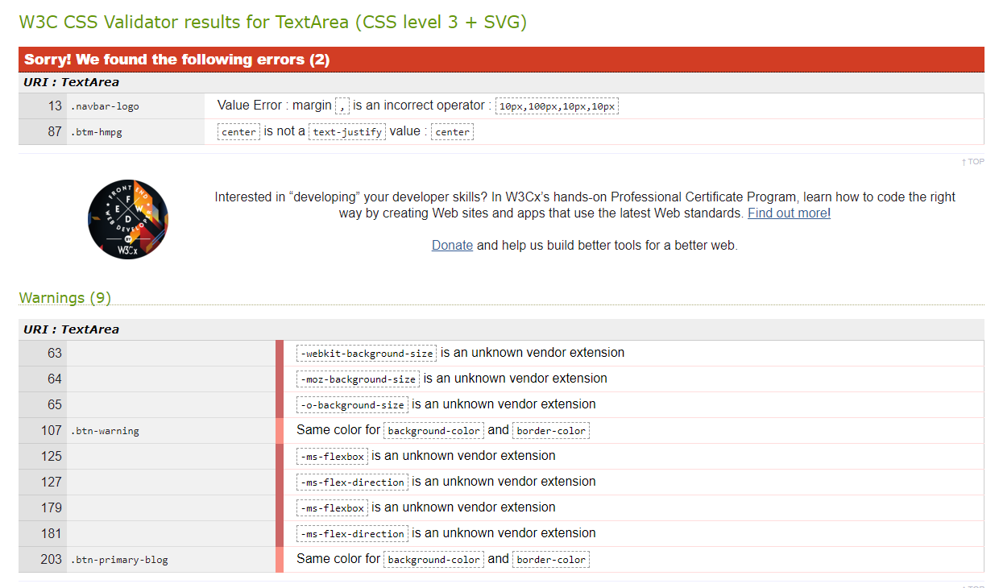
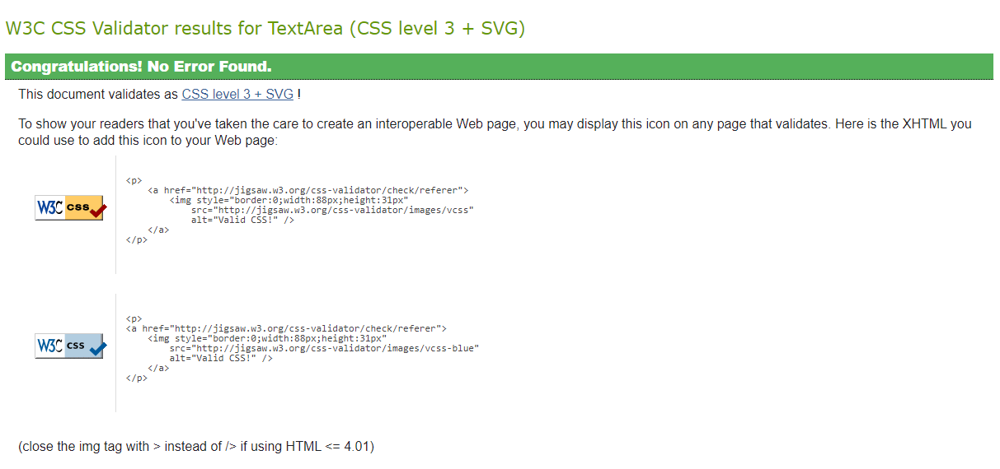

# Universal Relations Media

This is the first Milestone Project for the 
Code Institute's Full Stack Developer course.

In this project, we have been asked to utilise the 
skills that have been developed with HTML, CSS and 
a touch of JavaScript throughout the course. The use 
of JavaScript benefits us to create a more visually 
appealing page, while also allowing us to use as 
many of Bootstrap's functions as possible.

A further criteria for this project is aimed at writing
this page within the remits of Responsive Design. This 
will be adhered to and the visual impact of the pages 
will change depending on the media query that the 
device presents this content. By using Responsive Design 
principles, we can create a website that functions
efficiently and effectively across all devices.

This site, *Universal Relations Media*, is a faux 
blog site for articles that relate to politics and the 
arts across the globe.

## UX

The external user goal is to create a platform for user's 
to learn more about the topics covered within each article.
While highlighting the previous work conducted by the author.
Serving as a portfolio. 
To complement this learning experience, other articles that 
corroborate or could be considered as 'further reading' will 
be included on each post.

The site owner's goal is to utilise digital platforms to 
shape a personal portfolio of the author's academic research
and written work. This will improve their chance of employability
by highlighting the capabilities of the author across a 
number of academic disciplines: Political Philosophy and 
Full Stack Development. Indicative of this goal, is the 
choice to include a contact page for the author to promote 
collaboration and allow potential employers, or anyone that 
is interested in the site content, has the ability to reach 
out to the author.

[Wireframe](assets/images/wireframe.pdf)

Due to personal limitations, I diverged from the original wireframe
to aid the creation of my website and improve the overall aesthetic
theme throughout the pages.

## Features

Features that will be included are a landing page, two
blog pages - including real content written by the author, and a
contact page. This will showcase the abilities of the author
and provide insights into current affairs. One of the main
features of the site will be to include third party sources 
and their appropriate links. This allows the user to explore
the themes and content further, by their own volition. It
gives the user a choice towards how much time they would
like to dedicate to their own research and the capabilities
to do so. With this in mind, free content, partially-free
content (such as free monthly allocated articles by sources
such as New Statesman, The Atlantic, Foreign Affairs) and 
pay-to-view content will be balanced and included to create
a positive user experience, shaped by their own decisions. 

The most interesting and time consuming feature that was added
was the modal buttons at the bottom of the two blog pages.
Once clicked, these highlight all references used within the
content and where available online, the use is able to click
on the link and explore the material themselves.

### Features left to implement

I would of liked to have included a carousel on the bottom
of each page to link to any of the other pages across the
site.

## Technologies Used

I have utilised basic JavaScript functionality to complement
the use of Bootstrap's functions.

## Testing

Throughout the project, I have been viewing my site across a
number of devices. Including mobiles, tablets, a range of monitors
with different ratios and utilising the inspect element capability 
on Google Chrome to give me further insight into how the site 
functions across devices that I do not have access to.

During this period, my main focus was to ensure that the site 
was responsive, followed its theme and was as visually appealing
and was useable across all devices.

My largest issue has been with the navigation bar and footer.
This is due to issues with them overlapping or underlapping
the primary page content. Their general size across the pages
has also given me difficulties.

The second issue I have run in to, is making my pictures fully 
responsive. In some instances the pciture become cropped at certain
media queries and I have been unable to rectify this issue within
the timeframe of the project.

There are some final little aesthetic issues that I would like to fix.
Such as changing the hyperlink text on the index page to match
the theme of the rest of the page. On some devices elements also become 
slightly unaligned, such as the URM on the top right of the navigation
bar.

### W3 Validators

#### CSS

In my next project, I will make sure to be more proactive in documenting
testing as and when I encounter issues and provide the resolution that
I arrived at to overcome said issue.

## Deployment

I have utilised GitHub Pages to deploy this site.
This is due to the project being wholly created within GitPod and
utilising the public functionality of GitHub.

## Credits

### Content

All content has been written by the author and if any quotations or
images have been used they have been referenced directly within the 
content. This is through the Harvard referencing system, as it is the
method that was used when creating the content in the first place.

### Media

Any media that has been used across the site has either been created by
the author, or via royalty free images found on sites such as Pixabay.
Any images that do not conform to this have been directly referenced 
towards.

### Acknowledgements

I have utilised extra information to allow me to create this page from
Bootstrap's documentation and articles that can be found on W3. 

For minor issues, I have read through the Code Institute's material, 
its Slack channels and, as a last resort, forum posts in Stack Overflow.

I also referred to Clever Techie's Responsive Navbar with Bootstrap 4
video on Youtube to aid its creation https://www.youtube.com/watch?v=L0uNai3XyKQ

## Screenshots across different devices

#### Port

python3 -m http.server