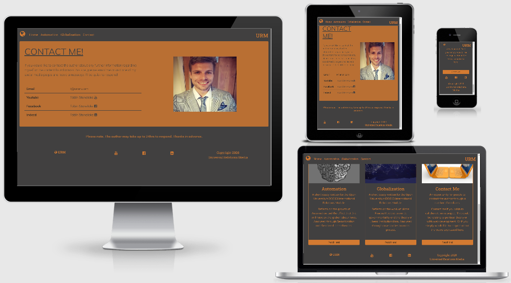

# Universal Relations Media

[View the live website here](https://tobinstonelake.github.io/urmv2/index.html)

This is the first Milestone Project for the 
Code Institute's Full Stack Developer course.

In this project, we have been asked to utilise the 
skills that have been developed with HTML, CSS and 
a touch of JavaScript throughout the course. The use 
of JavaScript benefits us to create a more visually 
appealing page, while also allowing us to use as 
many of Bootstrap's functions as possible.

A further criterion for this project is aimed at writing
this page within the remits of Responsive Design. This 
will be adhered to and the visual impact of the pages 
will change depending on the media query that the 
device presents this content. By using Responsive Design 
principles, we can create a website that functions
efficiently and effectively across all devices.

This site, *Universal Relations Media*, is a faux 
blog site for articles that relate to politics across 
the globe.

## UX

### User Stories

* First Time Visitor Goals
    1. As a First Time Visitor, I want to be able to easily access the
        authors own projects and contact page from the homepage and navigation bar.
    1. As a First Time Visitor, I wish to be able to learn more about the content
        that is presented across the site.
    1. As a First Time Visitor I want to gain a perspective towards the capabilities
        of the author's academic potential. In terms of both political theory and development.

* Returning and Frequent Visitor Goals
    1. As a Returning or Frequent Visitor, I want to be able to view the progession of the author's work.
        Periodically and dynamically.
    1. As a Returning or Frequent Visitor, I want to be able to easily contact the author to be able to 
        colloborate and gain any extra information that they would like.
    1. As a Returning or Frequent Visitor, I want to be able to have a number of different options towards 
        contacting the author.

* Site Owner Goals
    1. The Site Owner's goal is to utilise digital platforms to 
        shape a personal portfolio of the author's academic research
        and written work.
    1. The Site Owner's goal will improve their chance of employability
        by highlighting the capabilities of the author across a 
        number of academic disciplines: Political Philosophy and 
        Full Stack Development.
    1. The Site Owner's indication towards this goal is the 
        the choice to include a contact page for the author to promote 
        collaboration and allow potential employers or anyone that 
        is interested in the site content, can reach out to the author.

### Design

* Colour Scheme
    * The colour scheme used has been a light slate grey and darker orange. This is to create a
        visually appealing site that is akin to the _Night Mode_ found across a plethora of devices.

* Typography
    * There have been two fonts used throughout the project. Muli is the main font used throughout the
        website due to the author's preference. It has a clean and flippant style which highlights
        the tongue-in-cheek nature of the website name and author's style. This is complemented with
        Sans Serif as a fall back.
    * For the navigation bar and any other textual elements that can be considered as a logo, Roboto Slab
        has been utilised to define these textual elements as seperate from the content within the page.
        This has Serif as a fallback, also complementing the nature of a defined element of text away from
        the remaining content.

* Imagery
    * Images have been used on each page to create a more visually appealing experience for the user. The only
        page where an image will not be present is the contact page on smaller devices. This is to keep the contact
        page concise and easy to navigate as it has little content within. On larger devices it gives the user a visual
        impression of who the author is.
    * Across the other pages, images have been used to catch the user's eye and be representative of the content within.
        On the Automation page, there has been two images included which corroborate with the content. 

* Wireframes
    * NEEDS LINK

<!-- [Wireframe](assets/images/wireframe.pdf)

Due to personal limitations, I diverged from the original wireframe
to aid the creation of my website and improve the overall aesthetic
theme throughout the pages. -->

## Features

* Responsive across all devices.

* Interactive elements:
    * The main interactive element found on this site is the modal at the 
        bottom of the blog pages. This gives the user the ability to conduct
        their own research towards any information they find interesting within
        the content. This ability is abetted by the use of academically-standardised
        Harvard referencing, which is likely to be a format that the reader understands
        and provides them all the information to find sources that are physical materials, 
        such as books.            
    * To complement this ease of user-research further, any sources that are available
                online have been directly linked to and accessible by the user. This includes
                pay-to-view content, free content and sources from mainstream media.
    * The navigation bar is also interactive by the provision of a collapsible button that
        allows the user to easily find their way to any page on the site. While still adhering
        to the visual appeal of the site when viewed on smaller devices.

### Features left to implement

* I would have liked to have included a carousel on the bottom
of each page to link to any of the other pages across the
site.

## Technologies Used

### Languages Used

* [HTML 5](https://en.wikipedia.org/wiki/HTML5)
* [CSS3](https://en.wikipedia.org/wiki/Cascading_Style_Sheets)

### Frameworks, Libraries & Programs Used

1. [Bootstrap 4.5:](https://getbootstrap.com/docs/4.5/getting-started/introduction/)
    - Bootstrap was used to assist with the responsiveness and styling of the website.
1. [Google Fonts:](https://fonts.google.com/)
    - Google fonts were used to import the 'Muli' and 'Roboto Slab' fonts into the style.css file which is used on all pages throughout the project.
1. [Font Awesome:](https://fontawesome.com/)
    - Font Awesome was used on all pages throughout the website to add icons for aesthetic and UX purposes.
1. [jQuery:](https://jquery.com/)
    - jQuery came with Bootstrap to make the navbar responsive and other Bootstrap functions.
1. [Git](https://git-scm.com/)
    - Git was used for version control by utilizing the Gitpod terminal to commit to Git and Push to GitHub.
1. [GitHub:](https://github.com/)
    - GitHub is used to store the projects code after being pushed from Git.
1. [Balsamiq:](https://balsamiq.com/)
    - Balsamiq was used to create the [wireframes](https://en.wikipedia.org/wiki/Website_wireframe) during the design process.
1. [Microsoft Word:](https://www.microsoft.com/en-gb/microsoft-365/word)
    - Was used to write the content and ensure that the grammatical nature of the content was preserved.    

## Testing

### Achieved Testing

* Throughout the project, I have been viewing my site across a
number of devices. Including mobiles, tablets, a range of monitors
with different ratios and utilising the inspect element capability 
on Google Chrome to give me further insight into how the site 
functions across devices that I do not have access to.

* During this period, my main focus was to ensure that the site 
was responsive, followed its theme and was as visually appealing
and was useable across all devices.

* My largest issue has been with the navigation bar and footer.
This is due to issues with them overlapping or underlapping
the primary page content. Their general size across the pages
has also given me difficulties.

* Overcoming the aria-controls error I had when validating my code,
    required me to refer to Stack Overflow.

* Overcoming the thin nature of the modal content
    required me to refer to Stack Overflow.

### Further Testing

* In some instances, my pictures fully are not fully
    responsive. The picture becomes cropped at certain
    media queries and I have been unable to rectify this issue within
    the timeframe of the project.

### Known Issues

* There are some final little aesthetic issues that I would like to fix:
    * On some devices elements also become slightly unaligned, such as 
        the URM on the top right of the navigation bar.
    * When smaller devices are used in landscape mode, the footer on the
        contact page seems to be much larger than on other devices.
    * When smaller devices are used in landscape mode, some of the images can
        also become shrunk.

### W3 Validators

#### CSS

Test 1
[Test 1](assets/images/cssvalidatort1.png)

Test 2
[Test 2](assets/images/cssvalidatort2.png)

#### Index HTML

Test 1

Test 2

Test 3

#### Automation HTML

Test 1

Test 2

Test 3

#### Globalisation HTML

Test 1

Test 2

Test 3

#### Contact HTML

Test 1

Test 2

Test 3

Checked all links across all pages lead to the relevant pages.

One visual issue that I am unable to overcome is the margins when switching to
the Galaxy Fold emulator on Google Chrome's inspect function. Unsure whether this
is a browser issue or an issue that relates to my code. Is not affected
on any other emulated devices, though it does carry this issue through
after clicking on another emulated device. This latter aspect inspires
confidence that is a Chrome issue, rather than with my own code.

In my next project, I will make sure to be more proactive in documenting
testing as and when I encounter issues and provide the resolution that
I arrived at to overcome the said issue.

## Deployment

I have utilised GitHub Pages to deploy this site.
This is due to the project being wholly created within GitPod and
utilising the public functionality of GitHub.

## Credits

### Content

All content has been written by the author and if any quotations or
images have been used they have been referenced directly within the 
content. This is through the Harvard referencing system, as it is the
method that was used when creating the content in the first place.

### Media

Any media that has been used across the site has either been created by
the author, or via royalty-free images found on sites such as Pixabay.
Any images that do not conform to this have been directly referenced 
towards.

### Acknowledgements

I have utilised extra information to allow me to create this page from
Bootstrap's documentation and articles that can be found on W3. 

For minor issues, I have read through the Code Institute's material, 
its Slack channels and, as a last resort, forum posts in Stack Overflow.

I also referred to Clever Techie's Responsive Navbar with Bootstrap 4
video on Youtube to aid its creation https://www.youtube.com/watch?v=L0uNai3XyKQ

Overcame aria-controls issue by referring to this post on Stack Exchange:
https://webmasters.stackexchange.com/questions/60241/w3c-validation-error-aria-controls-attribute-must-point-to-an-element-in-the-sa

## Screenshots across different devices

#### Port

python3 -m http.server